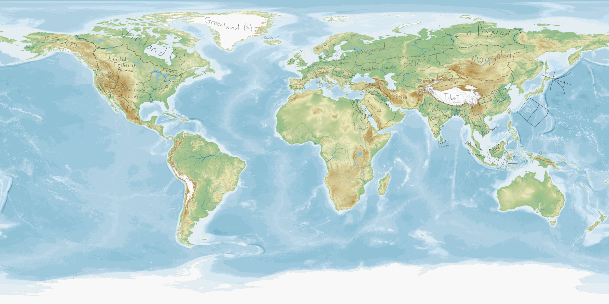

Alternate-history world archive

# How Few Remain

## Canon encyclopedia, strategic atlas, and worldbuilding command center

A searchable, cross-linked record of the states, cities, peoples, languages, wars, institutions, and historical development of the **How Few Remain** setting.

[Enter the world](world/world-in-1604.md){ .md-button .md-button--primary }
[Open the interactive globe](world/interactive-globe.md){ .md-button }
[Open the master timeline](history/master-timeline.md){ .md-button }
[Random article](#){ .md-button .hfr-random-trigger }

Current release · v0.10.8

  <figure class="hfr-home-map-figure">
    
    <figcaption><strong>Working world map · 1604 ATL</strong> Current placeholder cartography; borders, labels, and unresolved regions remain provisional.</figcaption>
  </figure>

  
<strong>1604</strong>Encyclopedia present

  
<strong>17</strong>Polity dossiers

  
<strong>10</strong>Major event files

  
<strong>51</strong>Reference pages

## Explore the archive

-   :material-earth:{ .lg .middle } **World Atlas**

    ---

    Survey the 1604 international system, regional powers, borders, cities, cultures, religions, and strategic tensions.

    [:octicons-arrow-right-24: Enter the atlas](world/index.md)

-   :material-timeline-clock:{ .lg .middle } **Historical Archive**

    ---

    Follow the timeline from Rome's early divergences through the industrial wars that created the modern world.

    [:octicons-arrow-right-24: Open the timeline](history/master-timeline.md)

-   :material-translate:{ .lg .middle } **Languages & Naming**

    ---

    Record scripts, dialects, pronunciation, terminology, personal names, and the evolution of Atlantic Standard.

    [:octicons-arrow-right-24: Browse languages](languages/index.md)

-   :material-scale-balance:{ .lg .middle } **Canon Command**

    ---

    Separate hard canon, derived conclusions, tentative ideas, active proposals, unresolved questions, and retired lore.

    [:octicons-arrow-right-24: Review canon control](reference/canon-guide.md)

## Current editorial snapshot

| Field | Current setting |
|---|---|
| Encyclopedia present | **1604 ATL** unless an article specifies another date |
| Highest authority | Current project-chat corrections and explicit user rulings |
| General setting direction | *Rome (With Colonialism)*, especially its later material |
| Organized reference | *Master Doc V3* |
| Older structured detail | *Master Doc V2*, only when compatible |
| Language authority | *AS Language Book* for Atlantic Standard and related questions |

!!! info "Living encyclopedia"
    The archive contains a substantial political and historical foundation, but the complete HFR corpus has not yet been imported. Unknown facts remain marked **TBD**, proposals remain distinct from canon, and superseded material is recorded rather than silently reused.

## What’s New in This Version

### v0.10.8 — Caesar’s Legions Article Expansion — 2026-08-27

The **Caesar’s Legions dossier has been rebuilt into a full Gulf-Roman national article**, carrying CL from the Roman Gulf colonies and Liga Caesarea through centuries inside the USA, the Great Indian War, the Miracle on the Bayou, secession, and the Legionary Civil War. The article now treats the state as a young military commonwealth built on a much older Gulf civilization, with dedicated sections on Mr C, pluralist Gulf-Roman paganism, Christian toleration, Gulf Occidental, regional identity, economy, military institutions, internal security, foreign relations, national myth, and the tension between restoration and genuinely new state formation.

-   :material-temple-hindu-outline:{ .lg .middle } **A Distinct Gulf Civilization**

    ---

    - Expanded Roman Gulf origins and the importance of **Liga Caesarea**
    - Reframed 1575 as restoration in Legionary national memory rather than simple rebellion
    - Added pluralist **Gulf-Roman paganism** and broad Christian toleration, with exact proselytization rules still TBD

-   :material-shield-sword-outline:{ .lg .middle } **Mr C and the Military Commonwealth**

    ---

    - Added Mr C as the central founder-hero and near-sacred civic figure without canonizing him as a god or prophet
    - Developed CL as a **decentralized military commonwealth**, not a generic dictatorship
    - Added strategic, riverine, Gulf, veteran, and internal-security dimensions to the state

-   :material-scale-balance:{ .lg .middle } **Two Roman Americas**

    ---

    - Great Indian War and Legionary Civil War are summarized through their importance to Gulf history rather than duplicated from event articles
    - Added distinct relationships with the USA, MDE, UTA, NCR, and New Vegas
    - Current territory now explicitly defers to the **Interactive Globe**, removing obsolete southern-Alabama and coarse-frontier wording

## Previous Release Notes

### v0.10.7 — United States Article Expansion — 2026-08-27

The United States dossier was rebuilt into a full national article covering federation, continental expansion, Cahokia, the Great Indian War, the Legionary Civil War, the centralist postwar order, former territories and claims, and wounded restorationism.

### v0.10.6 — Final Globe Cleanup — 2026-08-27

Removed the stray disconnected UTA fragments north of the Colorado system and added a lightweight drag/zoom rendering mode. Full map detail returns as soon as globe motion stops.

### v0.10.3 — Iroquois & River-System Rebuild — 2026-08-21

This patch makes the approved USA–Iroquois frontier shared topology and replaces the overly dense river display with the cleaner Natural Earth 1:50m named-river hierarchy, using consistent river importance across each full named system and zoom-based disclosure for smaller rivers.

-   :material-vector-combine:{ .lg .middle } **USA–Iroquois Shared Topology**

    ---

    - The approved frontier now partitions both country fills
    - Great Lakes water borders and political colors use the same line
    - Border edits can no longer leave the opposing fill behind

-   :material-water:{ .lg .middle } **Fewer, Continuous Rivers**

    ---

    - Uses Natural Earth’s simpler 1:50m base river network instead of the North America supplement
    - River importance is normalized across every segment sharing the same river name
    - Major rivers remain visually consistent along their full mapped course

-   :material-magnify-plus-outline:{ .lg .middle } **Zoom-Based Hydrology**

    ---

    - Major rivers at continental scale
    - Medium rivers at regional scale
    - Minor rivers only at close zoom
    - Dense bundled minor rivers are no longer used as the ordinary fallback

### v0.10.2 — River & Shared-Boundary Rebuild — 2026-08-21

This update moves the globe away from independent border/fill patches. River-following CL sectors restore their unsimplified feature geometry; USA–Vinland and UTA–アラスカ now partition both country fills from the same visible border; and the stationary river display upgrades to Natural Earth’s ranked 1:10m network when online.

-   :material-water:{ .lg .middle } **Ranked Rivers**

    ---

    - Natural Earth 1:10m becomes the primary stationary river display
    - Major rivers use stronger strokes based on source prominence rank rather than arbitrary line length
    - Bundled hydrology remains the offline and drag-time fallback

-   :material-vector-polyline:{ .lg .middle } **River-following CL**

    ---

    - Pearl and Mississippi sectors restore unsimplified river-source bends
    - CL–UTA restores the detailed river-heavy corridor while keeping road/mountain sectors simpler
    - CL–Great Basin restores the detailed Colorado River sector without reinstating arbitrary node quotas

-   :material-vector-combine:{ .lg .middle } **Shared Political Topology**

    ---

    - USA–Vinland and UTA–アラスカ borders now divide both neighboring fills
    - A border-line correction therefore also moves the country colors
    - This architecture will be extended to other problem frontiers only after visual approval

### v0.10.1 — Shared-Boundary Cartography Test — 2026-08-21

This update begins the globe’s cartographic-engine rebuild. Caesar’s Legions is the first test case: its country fill and visible political borders now come from one shared perimeter instead of separately edited line and polygon layers.

-   :material-vector-polyline:{ .lg .middle } **One Boundary, Two Countries**

    ---

    - Rebuilt the CL perimeter from geographic feature segments rather than arbitrary node targets
    - The CL fill is generated directly from the USA–CL, CL–UTA, CL–Great Basin, CL–MDE, and Gulf-coast perimeter
    - Neighboring political fills are clipped against that same perimeter so the border line and country colors cannot independently drift

-   :material-water-outline:{ .lg .middle } **Hydrology Architecture Selected**

    ---

    - HydroRIVERS is selected as the target hydrology model because it provides river order and long-term discharge attributes suitable for scale-aware river rendering
    - The full river display is intentionally **not** replaced in this test build; river rendering will be rebuilt after the CL topology is visually approved

-   :material-test-tube:{ .lg .middle } **Deliberately Narrow Scope**

    ---

    - v0.10.1 does not yet rebuild USA–Vinland or UTA–アラスカ
    - No new lore is introduced
    - The purpose of this release is to prove that shared topology fixes the color/border mismatch before applying it continent-wide

### v0.10 — North America Precision Cartography — 2026-08-21

- Replaced the **USA–Vinland** line with the new user-supplied mainland and maritime control chain.
- Corrected **Cape Breton Island, Long Island, and Florida** to the United States while keeping Cuba politically blank.
- Applied the supplied **Vinland sea-facing ownership polygon** to Greenland, Newfoundland, and Scandinavian Arctic islands without overriding mainland frontier decisions.
- Applied the supplied **アラスカ coastal polygon** and **UTA Olympic/Puget polygon** for Pacific ownership.
- Rebuilt the Great Lakes **USA–Iroquois** water route from the supplied Lake Erie–Detroit–Huron control chain.
- Increased precision on USA–CL, CL–UTA, CL–Great Basin, MDE–Great Basin, NCR–MDE, UTA–アラスカ, Vinland–アラスカ, and UTA–Vinland. The requested major shared borders now carry **500+ rendering nodes each**.
- Added river hierarchy: major systems are more visible, medium rivers intermediate, and smaller rivers remain subdued.
- No new polity lore was invented; added intermediate nodes are cartographic implementation only.

### v0.9 — Globe Visibility Hotfix — 2026-08-21

This emergency update fixes the blue-teal globe wash introduced in v0.8. It changes rendering stability only; no borders or setting lore were revised.

-   :material-earth:{ .lg .middle } **Political Colors Restored**

    ---

    - Corrected an inverted Vinland micro-polygon whose spherical winding caused D3 to interpret it as the complement of the tiny island fragment
    - The malformed fragment was effectively painting almost the entire globe with Vinland blue-gray
    - Country fills, neutral land, and ocean should now remain visually distinct at rest and while moving

-   :material-shield-check:{ .lg .middle } **Render Safety Guard**

    ---

    - Added a runtime spherical-winding sanity check before political polygons are rendered
    - Any future polygon component that accidentally describes more than a hemisphere is automatically flipped to its intended small region
    - This prevents a similar single-fragment failure from washing out the globe again

### v0.8 — Precision Globe Pass — 2026-08-21

This update is deliberately limited to globe behavior, border precision, and North American territorial cleanup. It does not add unrelated lore.

-   :material-water:{ .lg .middle } **Stable Drag Rendering**

    ---

    - Full land and political polygons now remain mounted while the globe moves
    - Only the hydrology layer switches to lighter interaction geometry
    - Rivers and lakes continue rotating during drag without the ocean flashing teal
    - Full-detail hydrology returns automatically when movement stops

-   :material-vector-polyline:{ .lg .middle } **Precision Border Rebuild**

    ---

    - CL borders were rebuilt with far denser geometry and fitted to the Pearl, Mississippi, Missouri/Platte–Republican corridor, Colorado system, and the established ridge corridors
    - Vinland’s UTA and アラスカ frontiers were densified and fitted much more closely to the Albany/Slave/Mackenzie, Fraser, Liard, and related geographic corridors
    - Control points remain anchors rather than simplistic straight-line vertices

-   :material-map-marker-path:{ .lg .middle } **North America Corrections**

    ---

    - Great Basin Mosaic now has a muted beige-gray regional fill
    - UTA retains the Olympic Peninsula and the full Pacific coast between the Columbia and Skagit
    - アラスカ is restricted to its North American colonial territory, including the confirmed Pacific/Alaskan coast and Aleutian system
    - The lower Mackenzie side is assigned consistently with the Vinland–アラスカ frontier
    - Greenland is fully Vinland-colored for the prototype; Iceland remains politically blank
    - USA–Vinland no longer draws an erroneous line across southeastern Quebec toward Anticosti
    - Lake Erie and Lake Superior boundaries now run through the lakes rather than jumping between shore points
    - The lower Mississippi/Delta is retained on the CL side of the confirmed frontier

-   :material-magnify-plus-outline:{ .lg .middle } **Atlas Navigation & Zoom**

    ---

    - Maximum zoom increased again for small-polity and future state/province inspection
    - New Vegas receives a substantially closer focus view
    - **Interactive Globe** is now a first-level navigation tab beside Home, World, History, and Languages

## Visual development queue

- **Global cartography:** definitive political map of the world in 1604 ATL.
- **Polity identity:** flags, seals, territorial maps, capitals, and national landscapes.
- **Military history:** campaign maps for the First Great Indian War and Novgorod–Scandinavian Wars.
- **Civilizational atmosphere:** industrial cities, rail corridors, ports, uniforms, architecture, and sacred landscapes.

## Earlier releases

- **v0.7 — Globe Corrections & Performance:** continuous drag-time hydrology, deeper zoom, initial Pacific Northwest/St. Lawrence/Rio Grande corrections, and clearer NCR/UTA color separation.

- **v0.6 — North America Globe Prototype:** first coded, draggable political globe with HFR vector borders, hydrology, polity dossiers, and provisional-border styling.

- **v0.5 — Readable Article Sidebar:** image-above-factbox article layout and restored overview readability.

- **v0.4 — Compact Atlas:** working world map, smaller UI, New World navigation, expanded Iroquois theater, and random article discovery.
- **v0.3 — The Atlas Interface:** complete visual overhaul, automatic image placeholders, and the archive command-center homepage.
- **v0.2 — Northern and Eastern European Balance:** Scandinavia, Poland–Lithuania, Golden Horde, and the rebuilt northern wars.
- **v0.1 — North American Powers:** seven polity articles, United States expansion, and the detailed First Great Indian War revision.
- **Historical Backbone:** master timeline, 1604 world overview, geopolitical tensions, canon dashboard, and foundational event articles.

## Recommended next development

- Test globe dragging to confirm the ocean no longer changes color during interaction
- Inspect the rebuilt CL and Vinland frontiers at high zoom for any remaining river/ridgeline deviations
- Confirm the Great Basin fill and the UTA/NCR/アラスカ Pacific Northwest seams
- Test New Vegas at maximum zoom before adding any future state/provincial boundary layer
