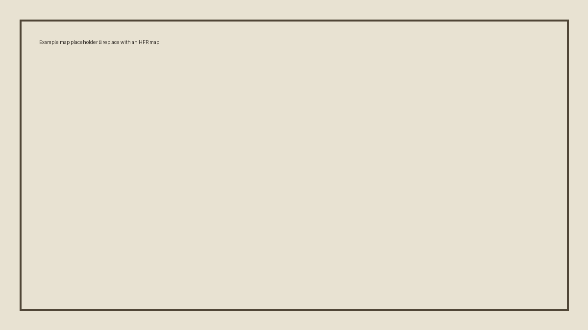

# How to Edit the Encyclopedia

## Launch the site

On Windows, double-click `setup_and_run.bat` the first time. On later visits, double-click `run_site.bat`.

The preview appears at:

```text
http://127.0.0.1:8000
```

The preview exists only on your computer unless you deliberately publish it.

## Edit an article

Open any `.md` file inside the `docs` folder using a text editor. Visual Studio Code is convenient, but Notepad works.

A heading begins with `#`:

```markdown
# Article Title

## Major section

### Subsection
```

Links use this format:

```markdown
[Hijez Sultanate](../polities/hijez-sultanate.md)
```

Images should be placed in `docs/assets/images/`. The v0.4 interface automatically displays future-image positions until curated visuals are added. Read the [Image & Visual Guide](image-guide.md) before replacing them.

A main article image should use the `hfr-feature-image` class:

```markdown
{ .hfr-feature-image }
```

Adding that class suppresses the article's automatic feature placeholder.

## Add an article to navigation

Open `mkdocs.yml` and add the page beneath the appropriate section:

```yaml
- Polities:
    - Browse Polities: polities/index.md
    - Hijez Sultanate: polities/hijez-sultanate.md
    - New Article: polities/new-article.md
```

Spacing matters in YAML. Use spaces, not tabs.

## Check for errors

Run `build_site.bat` on Windows. A successful strict build confirms that the pages and navigation are internally valid.

## Work with ChatGPT

A useful update request would be:

> Update the Hijez Sultanate article with this new ruling. Show every other article and timeline entry that must change, preserve obsolete material in canon notes, and return the revised project files.

Keep the most current encyclopedia folder or ZIP available when requesting edits so changes can be made against the latest version.
